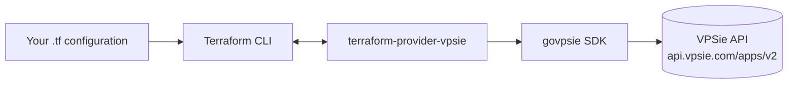
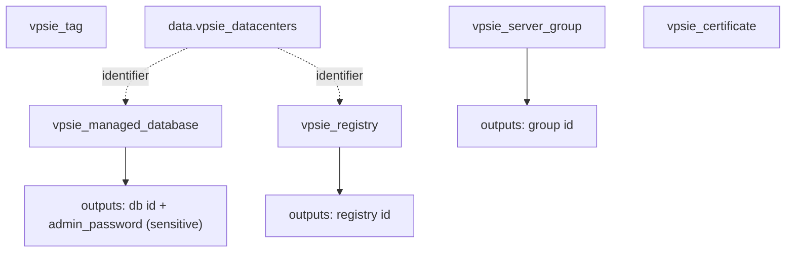

# Terraform Provider for VPSie

[](https://github.com/vpsie/terraform-provider-vpsie/actions/workflows/test.yml)
[](https://registry.terraform.io/providers/vpsie/vpsie/latest)
[](go.mod)
[](LICENSE)

The VPSie Terraform provider lets you manage your [VPSie](https://vpsie.com)
cloud infrastructure as code — servers, storage, networking, DNS, load
balancers, Kubernetes, container registries, managed databases, certificates,
tags and more — using [Terraform](https://www.terraform.io) or
[OpenTofu](https://opentofu.org).

## How it works



The provider is built on the
[Terraform Plugin Framework](https://developer.hashicorp.com/terraform/plugin/framework)
and calls the VPSie API through the [`govpsie`](https://github.com/vpsie/govpsie)
SDK.

## Requirements

- [Terraform](https://developer.hashicorp.com/terraform/downloads) >= 1.0 (or OpenTofu >= 1.6)
- A VPSie API access token
- [Go](https://go.dev/doc/install) >= 1.25 — only to build the provider from source

## Using the provider

```hcl
terraform {
  required_providers {
    vpsie = {
      source = "vpsie/vpsie"
    }
  }
}

provider "vpsie" {
  # Recommended: export VPSIE_ACCESS_TOKEN instead of hard-coding a token.
  access_token = var.vpsie_access_token
}
```

Provide the token through the environment so it never lands in configuration or
state files:

```sh
export VPSIE_ACCESS_TOKEN="your-api-token"
```

### Example

```hcl
resource "vpsie_tag" "prod" {
  name  = "production"
  color = "#ff0000"
}

resource "vpsie_server_group" "web" {
  group_name        = "web-tier"
  group_description = "Front-end web servers"
  is_distributed    = true
}

resource "vpsie_managed_database" "app" {
  name                  = "app-db"
  db_type               = "mysql"
  datacenter_identifier = "ams1"
  plan_id               = 1
  node_count            = 2
}
```

A complete, runnable configuration (server group + managed database + registry +
certificate, with variables and outputs) is in
[`examples/complete`](./examples/complete). It maps to these resources:



## Supported resources & data sources

Every resource has a matching `data` source for lookups unless noted.

### Compute

| Resource | Data source |
| --- | --- |
| `vpsie_server` | `vpsie_servers` |
| `vpsie_image` | `vpsie_images` |
| `vpsie_server_snapshot` | `vpsie_server_snapshots` |
| `vpsie_snapshot_policy` | `vpsie_snapshot_policies` |
| `vpsie_backup` | `vpsie_backups` |
| `vpsie_backup_policy` | `vpsie_backup_policies` |
| `vpsie_server_group`, `vpsie_server_group_member` | `vpsie_server_groups` |
| `vpsie_script` | `vpsie_scripts` |
| `vpsie_sshkey` | `vpsie_sshkeys` |

### Storage

| Resource | Data source |
| --- | --- |
| `vpsie_storage`, `vpsie_storage_attachement` | `vpsie_storages` |
| `vpsie_storage_snapshot` | `vpsie_storage_snapshots` |
| `vpsie_bucket` | `vpsie_buckets` |

### Networking

| Resource | Data source |
| --- | --- |
| `vpsie_vpc`, `vpsie_vpc_server_assignment` | `vpsie_vpcs` |
| `vpsie_firewall`, `vpsie_firewall_attachment` | `vpsie_firewalls` |
| `vpsie_floating_ip` | `vpsie_floating_ips` / `vpsie_ips` |
| `vpsie_gateway` | `vpsie_gateways` |
| `vpsie_loadbalancer` | `vpsie_loadbalancers` |
| `vpsie_domain`, `vpsie_dns_record`, `vpsie_reverse_dns` | `vpsie_domains` |
| `vpsie_certificate` | `vpsie_certificates` |

### Platform

| Resource | Data source |
| --- | --- |
| `vpsie_kubernetes`, `vpsie_kubernetes_group` | `vpsie_kubernetes`, `vpsie_kubernetes_group` |
| `vpsie_registry` | `vpsie_registries` |
| `vpsie_managed_database` | `vpsie_managed_databases` |

### Account & operations

| Resource | Data source |
| --- | --- |
| `vpsie_project` | `vpsie_projects` |
| `vpsie_tag` | `vpsie_tags` |
| `vpsie_monitoring_rule` | `vpsie_monitoring_rules` |
| `vpsie_access_token` | `vpsie_access_tokens` |
| — | `vpsie_datacenters` |

Full, per-attribute documentation for every resource and data source lives in
[`docs/`](./docs) and on the
[Terraform Registry](https://registry.terraform.io/providers/vpsie/vpsie/latest/docs).

## Tips & troubleshooting

- **Keep tokens out of code.** Prefer `VPSIE_ACCESS_TOKEN` over a literal
  `access_token`. The attribute is marked sensitive, so Terraform redacts it in
  plan output.
- **Protect your state.** Computed secrets such as
  `vpsie_managed_database.admin_password` are stored in state. Use an encrypted
  remote backend and restrict access to it.
- **Importing existing resources.** Most resources support import by identifier:
  `terraform import vpsie_server_group.example <identifier>`.
- **Tag deletion.** The VPSie API has no endpoint to delete a tag definition, so
  destroying a `vpsie_tag` removes it from state and emits a warning; remove the
  tag itself from the console if needed.
- **Scaling managed databases.** Changing `node_count` scales the cluster one
  node at a time; other attributes force replacement.
- **Importing certificates.** The API does not return the source `domain_id`, so
  after `terraform import vpsie_certificate.example <identifier>` set `domain_id`
  in configuration to match the certificate to avoid a planned replacement.
- **Server group membership.** Import with the composite id
  `terraform import vpsie_server_group_member.example <group_identifier>,<vm_identifier>`.

## Developing the provider

Common tasks are wrapped in the [`GNUmakefile`](GNUmakefile):

```sh
make            # fmt, lint, build, test
make build      # compile the provider
make lint       # golangci-lint v2
make docs       # regenerate docs from schemas and examples
make test       # unit/compile tests (no credentials)
make testacc    # acceptance tests (creates real resources; needs a token)
make install    # build + install for a local dev override (scripts/local-install.sh)
```

Or run the underlying commands directly:

```sh
go build -v .
golangci-lint run
go generate ./...
go test ./...
TF_ACC=1 VPSIE_ACCESS_TOKEN="your-api-token" go test ./... -v -timeout 120m
```

To try local changes, add a
[dev override](https://developer.hashicorp.com/terraform/cli/config/config-file#development-overrides-for-provider-developers)
to `~/.terraformrc`:

```hcl
provider_installation {
  dev_overrides {
    "vpsie/vpsie" = "/path/to/your/GOBIN"
  }
  direct {}
}
```

## Contributing

1. Fork the repository and create a feature branch.
2. Follow the existing service layout in `internal/services/<service>/`
   (`*_resource.go` + `*_data_source.go`) and register new items in
   `internal/provider/provider.go`.
3. Add examples under `examples/`, run `go generate ./...` to refresh `docs/`,
   and make sure `go build`, `golangci-lint run` and `go test ./...` pass.

## License

Distributed under the Mozilla Public License 2.0. See [LICENSE](LICENSE).
